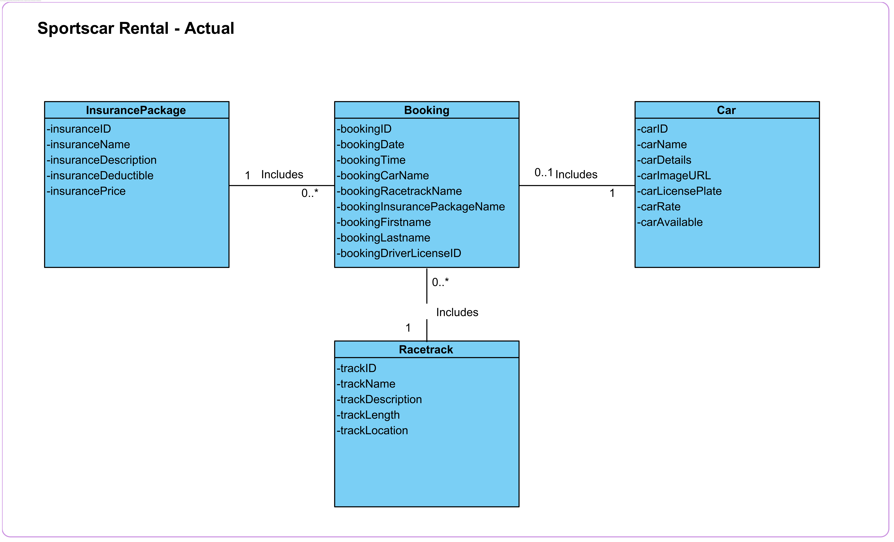

# Sportscar Rental Project

This is the Sportscar Rental project for the Internet Technology Module.
Created by Phillip Altenbach, Ryan Kreis, Gabriel Schnelli, Ranuthan Sittanpalam

## Contents:
- [Analysis](#analysis)
  - [Scenario](#scenario)
  - [User Stories](#user-stories)
  - [Use Case](#use-case)
- [Design](#design)
  - [Prototype Design](#prototype-design)
  - [Domain Design](#domain-design)
  - [Business Logic](#business-logic)
- [Implementation](#implementation)
  - [Backend Technology](#backend-technology)
  - [Frontend Technology](#frontend-technology)
- [Project Management](#project-management)
  - [Roles](#roles)
  - [Milestones](#milestones)

## Analysis
> 🚧: You can reuse the analysis (you made) from other projects (e.g., requirement engineering), but it must be submitted according to the following template. 


## Scenario

The Sportscar Rental Project is a web application for a generic sportscar rental company. Users are able to rent vehicles from a selection at a given date and time. Insurance Packages can be selected with a vehicle rental. Admin users can add, remove and edit vehicles.

### User Stories: 

#### Insurance Packages:
- As a user, I want to view different insurance packages available for my rental, so that I can select the package that best matches my risk preferences and budget.

- As an administrator, I want to add new insurance packages to the system, so that I can offer more choices to our users based on their needs and feedback. 

- As an administrator, I want to update details of existing insurance packages, so that I can ensure the information is current and accurate. 

- As an administrator, I want to delete outdated insurance packages, so that users are only presented with relevant options. 

#### Racetracks 
- As a user, I want to browse through available racetracks, so that I can select a track that suits my driving skills and preferences. 

- As an administrator, I want to add new racetracks, so that users have access to more options for their driving experiences. 

- As an administrator, I want to update information on existing racetracks, so that the listings stay accurate and informative.

- As an administrator, I want to delete racetracks that are no longer available, to keep the platform updated and avoid confusion for the users. 

#### Cars 
- As a user, I want to view a list of available sports cars, so that I can choose a car that excites me and meets my performance expectations. 

- As an administrator, I want to add new sports cars to our inventory, so that I can provide a wider range of choices to our users. 

- As an administrator, I want to update the details of the sports cars in our inventory, so that all the specifications and availability are correct.

- As an administrator, I want to remove sports cars from our inventory that are no longer for rent, to ensure our users see only those cars that they can book. 

#### NEU User Management
- As a visitor, I want to browse all the information on the website without needing to create an account, so that I can freely explore the available options.

- As a visitor, I want to make a booking without needing to create an account, so that I can quickly and easily arrange my driving experience.

- As a visitor, I want to provide my full name and driver's license ID when making a booking, so that my identity and eligibility can be verified.

- As an administrator, I want to manage all information about cars, insurance packages, and racetracks, so that I can keep the system up to date and accurate.

- As an administrator, I want to view all bookings, so that I can manage and oversee the reservations made by visitors.

- As an administrator, I want to edit bookings, so that I can update or correct details as needed.
  
- As an administrator, I want to log into my account, so that I can access the admin-only section to perform tasks related to car management and booking oversight.

- As an administrator, I want to see what bookings have been made, so that I can monitor and manage rental activities effectively.
  
#### User Management
As a visitor, I want to register for an account, so that I can book sports cars and track my rental history. 

As a user, I want to log into my account, so that I can access personalized features and manage my bookings. 

As an administrator, I want to activate and deactivate user accounts, so that I can manage access to the web application effectively. 

As an administrator, I want to assign and manage roles for users, so that I can control the permissions and access rights within the application. 

As a user, I want to update my profile information, so that my contact details and password remain current and secure. 

As a user, I want to upload my driver’s license information for validation purposes, to be able to initiate bookings.

### Booking:
- As a visitor, I want to select a date and time for my booking, so that I can schedule my driving experience at my convenience.

- As a visitor, I want to choose a sports car, a racetrack, and an insurance package as part of my booking, so that I can customize my experience to my preferences.

- As an administrator, I want to view all bookings, so that I can manage and oversee the reservations made by visitors.

- As an administrator, I want to edit bookings, so that I can update or correct details as needed.

### Use Case


## Design
> 🚧: Keep in mind the Corporate Identity (CI); you shall decide appropriately the color schema, graphics, typography, layout, User Experience (UX), and so on.

### Wireframe
> 🚧: It is suggested to start with a wireframe. The wireframe focuses on the website structure (Sitemap planning), sketching the pages using Wireframe components (e.g., header, menu, footer) and UX. You can create a wireframe already with draw.io or similar tools. 

Starting from the home page, we can visit different pages. Available public pages are visible in the menu...

### Prototype
> 🚧: A prototype can be designed using placeholder text/figures in Budibase. You don't need to connect the front-end to back-end in the early stages of the project development.

### Domain Design
> 🚧: Provide a picture and describe your domain model; you may use Entity-Relationship Model or UML class diagram. Both can be created in Visual Paradigm - we have an academic license for it.

The `ch.fhnw.sportscarrental.data.domain` package contains the following domain objects / entities including getters and setters:

The domain model for the Sportscar Rental system consists of the following entities:

#### InsurancePackage:
Represents an insurance package with following attributes: insuranceID, insuranceName, insuranceDescription, insuranceDeductible, and insurancePrice.
#### Booking:
Represents a booking which includes bookingID, bookingDate, bookingTime, bookingCarName (selected Car), bookingRacetrackName, bookingInsurancePackageName, bookingFirstname, bookingLastname, and bookingDriverLicenseID.
#### Car:
Represents a car available for rent including following attributes: carID, carName, carDetails, carImageURL, carLicensePlate, carRate, and carAvailable (true or false).
#### Racetrack:
Represents a racetrack where the rented cars can be driven, including following attributes: trackID, trackName, trackDescription, trackLength, and trackLocation.

Each booking must contain exactly one insurance package, one selected car, and one selected race track.
An insurance package and a race track can be included in zero or many bookings.
A car can be included in zero or one booking (e.g., if a car is not booked or being maintained).



### Business Logic 
> 🚧: Describe the business logic for **at least one business service** in detail. If available, show the expected path and HTPP method. The remaining documentation of APIs shall be made available in the swagger endpoint. The default Swagger UI page is available at /swagger-ui.html.

Based on the UC-4, there will be two offers and a standard offer. Given a location, a message is shown accordingly:

- If the location is "Basel", the message is "10% off on all large pizzas!!!"
- If the location is "Brugg", the message is "two for the price of One on all small pizzas!!!"
- Otherwise, the message is "No special offer".

**Path**: [`/api/menu/?location="Basel"`] 

**Param**: `value="location"` Admitted value: "Basel","Brugg".

**Method:** `GET`

## Implementation
> 🚧: Briefly describe your technology stack, which apps were used and for what.

### Backend Technology
> 🚧: It is suggested to clone this repository, but you are free to start from fresh with a Spring Initializr. If so, describe if there are any changes to the PizzaRP e.g., different dependencies, versions & etc... Please, also describe how your database is set up. If you want a persistent or in-memory H2 database check [link](https://github.com/FHNW-INT/Pizzeria_Reference_Project/blob/main/pizza/src/main/resources/application.properties). If you have placeholder data to initialize at the app, you may use a variation of the method **initPlaceholderData()** available at [link](https://github.com/FHNW-INT/Pizzeria_Reference_Project/blob/main/pizza/src/main/java/ch/fhnw/pizza/PizzaApplication.java).

This Web application is relying on [Spring Boot](https://projects.spring.io/spring-boot) and the following dependencies:

- [Spring Boot](https://projects.spring.io/spring-boot)
- [Spring Data](https://projects.spring.io/spring-data)
- [Java Persistence API (JPA)](http://www.oracle.com/technetwork/java/javaee/tech/persistence-jsp-140049.html)
- [H2 Database Engine](https://www.h2database.com)

To bootstrap the application, the [Spring Initializr](https://start.spring.io/) has been used.

Then, the following further dependencies have been added to the project `pom.xml`:

- DB:
```XML
<dependency>
			<groupId>com.h2database</groupId>
			<artifactId>h2</artifactId>
			<scope>runtime</scope>
</dependency>
```

- SWAGGER:
```XML
   <dependency>
      <groupId>org.springdoc</groupId>
      <artifactId>springdoc-openapi-starter-webmvc-ui</artifactId>
      <version>2.3.0</version>
   </dependency>
```

### Frontend Technology
#### Views
Vehicles:

Insurance Packages:

Racetracks:

Manage Vehicles:


> 🚧: Describe your views and what APIs is used on which view. If you don't have access to the Internet Technology class Budibase environment(https://inttech.budibase.app/), please write to Devid on MS teams.

This Web application was developed using Budibase and it is available for preview at https://inttech.budibase.app/builder/app/app_dev_inttech_4e92b1b0a5324ff78ede1ee5149fa44c.

## Execution
> 🚧: Please describe how to execute your app and what configurations must be changed to run it. 

The codespace URL of this Repo is subject to change. Therefore, the Budibase PizzaRP webapp is not going to show any data in the view, when the URL is not updated or the codespace is offline. Follow these steps to start the webservice and reconnect the webapp to the new webservice url. 

> 🚧: This is a shortened description for example purposes. A complete tutorial will be provided in a dedicated lecture.

1. Clone PizzaRP in a new repository.
2. Start your codespace (see video guide at: [link](https://www.youtube.com/watch?v=_W9B7qc9lVc&ab_channel=GitHub))
3. Run the PizzaRP main available at PizzaApplication.java on your own codespace.
4. Set your app with a public port, see the guide at [link](https://docs.github.com/en/codespaces/developing-in-a-codespace/forwarding-ports-in-your-codespace).
5. Create an own Budibase app, you can export/import the existing Pizzeria app. Guide available at [link](https://docs.budibase.com/docs/export-and-import-apps).
6. Update the pizzeria URL in the datasource and publish your app.

## Project Management
> Communication via Teams and In-Person. Work was done remotely and during in-person working sessions at the FHNW Campus Basel.
> 
> Phillip Altenbach: Team Lead, Frontend & Backend
> Ryan Kreis: Frontend & Backend
> Ranuthan Sittanpalam: Frontend & Documentation
> Gabriel Schnelli: Backend & Documentation

### Milestones
1. **Analysis**: Scenario ideation, use case analysis and user story writing.
2. **Prototype Design**: Creation of wireframe and prototype.
3. **Domain Design**: Definition of domain model.
4. **Business Logic and API Design**: Definition of business logic and API.
5. **Data and API Implementation**: Implementation of data access and business logic layers, and API.
6. **Security and Frontend Implementation**: Integration of security framework and frontend realisation.
7. (optional) **Deployment**: Deployment of Web application on cloud infrastructure.


#### Maintainer
- Charuta Pande
- Devid Montecchiari

#### License
- [Apache License, Version 2.0](blob/master/LICENSE)
