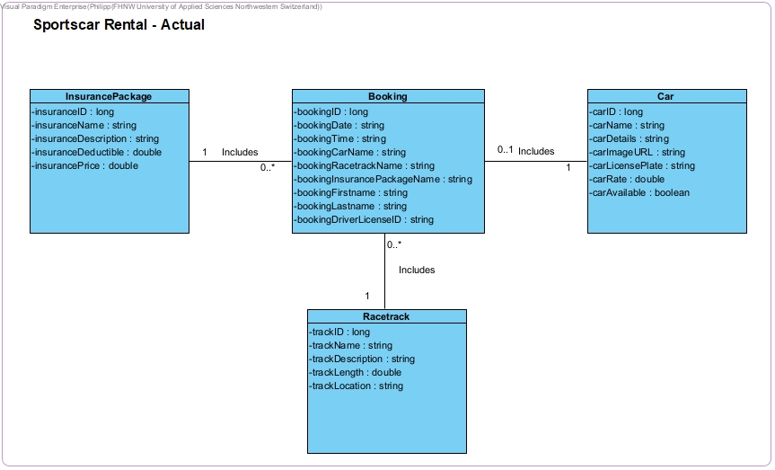

# SportsCar Rental Project

This is the documentation for the sports car rental project of the Internet Technology module.
Created by Phillip Altenbach, Ryan Kreis, Gabriel Schnelli, and Ranuthan Sittanpalam from the University of Applied Sciences and Arts Northwestern Switzerland (FHNW).

## Contents:
- [Analysis](#analysis)
  - [Scenario](#scenario)
  - [User Stories](#user-stories)
  - [Use Case](#use-case)
- [Design](#design)
  - [Prototype Design](#prototype-design)
  - [Domain Design](#domain-design)
  - [Business Logic](#business-logic)
- [Implementation](#implementation)
  - [Backend Technology](#backend-technology)
  - [Frontend Technology](#frontend-technology)
- [Project Management](#project-management)
  - [Roles](#roles)
  - [Milestones](#milestones)

## Analysis

### Scenario

The Sportscar Rental Project is a web application for a generic sportscar rental company. Users are able to rent vehicles from a selection at a given date and time. Insurance Packages can be selected with a vehicle rental. Admin users can add, remove and edit vehicles.

### User Stories: 

#### Insurance Packages:
- As a user, I want to view different insurance packages available for my rental, so that I can select the package that best matches my risk preferences and budget.

- As an administrator, I want to add new insurance packages to the system, so that I can offer more choices to our users based on their needs and feedback. 

- As an administrator, I want to update details of existing insurance packages, so that I can ensure the information is current and accurate. 

- As an administrator, I want to delete outdated insurance packages, so that users are only presented with relevant options. 

#### Racetracks:  
- As a user, I want to browse through available racetracks, so that I can select a track that suits my driving skills and preferences. 

- As an administrator, I want to add new racetracks, so that users have access to more options for their driving experiences. 

- As an administrator, I want to update information on existing racetracks, so that the listings stay accurate and informative.

- As an administrator, I want to delete racetracks that are no longer available, to keep the platform updated and avoid confusion for the users. 

#### Cars: 
- As a user, I want to view a list of available sports cars, so that I can choose a car that excites me and meets my performance expectations. 

- As an administrator, I want to add new sports cars to our inventory, so that I can provide a wider range of choices to our users. 

- As an administrator, I want to update the details of the sports cars in our inventory, so that all the specifications and availability are correct.

- As an administrator, I want to delete sports cars from our inventory that are no longer for rent, to ensure our users see only those cars that they can book.

- As an administrator, I want to make cars unavailable for booking, to ensure customer cannont select cars during the booking process which are beeing maintained.

#### User Management: 
- As a user, I want to browse all the information on the website without needing to create an account, so that I can freely explore the available options.

- As a user, I want to make a booking without needing to create an account, so that I can quickly and easily arrange my driving experience.

- As an administrator, I want to manage all information about cars, insurance packages, and racetracks, so that I can keep the system up to date and accurate.
  
- As an administrator, I want to log into my account, so that I can access the admin-only section to perform tasks related to car management and booking oversight.
  
#### Booking: 
- As a user, I want to select a date and time for my booking, so that I can schedule my driving experience at my convenience.

- As a user, I want to choose a sports car, a racetrack, and an insurance package as part of my booking, so that I can customize my experience to my preferences.
  
- As a user, I want to provide my full name and driver's license ID when making a booking, so that my identity and eligibility can be verified.

- As an administrator, I want to view all bookings, so that I can manage and oversee the reservations made by visitors.

- As an administrator, I want to edit bookings, so that I can update or correct details as needed.

### Use Case:
As per discussion with the lecturers in class, it is sufficient to only provide user stories for this project.

## Design
We decided to maintain the simple, modern design that Budibase offers as standard, while customizing font weights, sizes, and button colors/types to fit our needs. For the logo, we selected a sleek and simple design of a sports car to align with the brand image.

### Wireframes
All of the following wireframes were created with Visual Paradigm.

https://github.com/AltPhilipp/SportsCarRental/blob/main/images/Wireframe_About_Page.jpg
https://github.com/AltPhilipp/SportsCarRental/blob/main/images/Wireframe_All_Cars.jpg
https://github.com/AltPhilipp/SportsCarRental/blob/main/images/Wireframe_Booking.jpg
https://github.com/AltPhilipp/SportsCarRental/blob/main/images/Wireframe_Car_Details.jpg
https://github.com/AltPhilipp/SportsCarRental/blob/main/images/Wireframe_Insurance_Packages.jpg
https://github.com/AltPhilipp/SportsCarRental/blob/main/images/Wireframe_Login_and_Admin_Panel.jpg
https://github.com/AltPhilipp/SportsCarRental/blob/main/images/Wireframe_Tracks.jpg

### Prototype
We have created some very ambitious prototypes using Visily. These can be accessed under the following link:

https://app.visily.ai/projects/319f7cef-5aa7-4a63-bd4b-797c76e071ab/boards/863487

### Domain Design
The `ch.fhnw.sportscarrental.data.domain` package contains the following domain objects/entities including getters and setters:

The domain model for the Sportscar Rental system consists of the following entities:

#### InsurancePackage:
Represents an insurance package with the following attributes: insuranceID, insuranceName, insuranceDescription, insuranceDeductible, and insurancePrice.
#### Booking:
Represents a booking which includes bookingID, bookingDate, bookingTime, bookingCarName (selected Car), bookingRacetrackName, bookingInsurancePackageName, bookingFirstname, bookingLastname, and bookingDriverLicenseID.
#### Car:
Represents a car available for rent including the following attributes: carID, carName, carDetails, carImageURL, carLicensePlate, carRate, and carAvailable (true or false).
#### Racetrack:
Represents a racetrack where the rented cars can be driven, including the following attributes: trackID, trackName, trackDescription, trackLength, and trackLocation.

Each booking must contain exactly one insurance package, one selected car, and one selected race track.
An insurance package and a race track can be included in zero or many bookings.
A car can be included in zero or one booking (e.g., if a car is not booked or being maintained).

The following domain model was created with Visual Pradigm.



### Business Logic 
#### Business Rule 1:
The following business rule was derived on the basis of the first user story described in the "Cars" section: "As an administrator, I want to make cars unavailable for booking to ensure that customers cannot select cars that are being serviced during the booking process. Therefore, if the availability of a car is set to "false", the car cannot be selected by the user during the booking process.".
This business logic was realized within Budibase with the help of a filter on the data provider used for the booking table.

#### Business Rule 2:
Based on several user stories presented above, only authenticated administrators are allowed to perform add, update, or delete requests.

**Path**: [`/api/admin/cars`] (example for adding a car)

**Method:** `POST` (example for adding a car)

**Description**: This API endpoint requires user authentication to add a new car to the inventory. The user must have admin privileges.

**Changes made within `SecurityConfig.java` class**
```
.requestMatchers("/**").hasAuthority("SCOPE_READ")
                                                .requestMatchers(HttpMethod.PUT, "/**").hasRole("ADMIN")
                                                .requestMatchers(HttpMethod.DELETE, "/**").hasRole("ADMIN")
                                                .requestMatchers(HttpMethod.POST, "/**").hasRole("ADMIN")
```


## Implementation

### Backend Technology
This Web application is relying on [Spring Boot](https://projects.spring.io/spring-boot) and the following dependencies:

- [Spring Boot](https://projects.spring.io/spring-boot)
- [Spring Data](https://projects.spring.io/spring-data)
- [Java Persistence API (JPA)](http://www.oracle.com/technetwork/java/javaee/tech/persistence-jsp-140049.html)
- [H2 Database Engine](https://www.h2database.com)

To bootstrap the application, the [Spring Initializr](https://start.spring.io/) has been used.

Then, the following further dependencies have been added to the project `pom.xml`:

- DB:
```XML
<dependency>
			<groupId>com.h2database</groupId>
			<artifactId>h2</artifactId>
			<scope>runtime</scope>
</dependency>
```

- SWAGGER:
```XML
   <dependency>
      <groupId>org.springdoc</groupId>
      <artifactId>springdoc-openapi-starter-webmvc-ui</artifactId>
      <version>2.3.0</version>
   </dependency>
```

### Frontend Technology
The frontend was developed using Budibase, a low-code platform that enables rapid design and deployment of web applications. 

#### Views and used API's

**Our Cars:**
- `get_all_vehicles` *(GET)*

**Car Details:**
- `get_vehicle_by_id` *(GET)*

**Insurance Packages:**
- `get_all_insurance_packages` *(GET)*

**The Track:**
- `get_all_racetracks` *(GET)*

**Book now:**
- `get_all_vehicles` *(GET)*
- `get_all_racetracks` *(GET)*
- `get_all_insurance_packages` *(GET)*
- `add_booking` *(POST)*

**Login:**
- `login_user` *(GET)*

**Login (Admin Section):**
- `get_all_vehicles` *(GET)*
- `get_all_bookings` *(GET)*
- `add_vehicle_binding` *(POST)*
- `update_vehicle_binding` *(PUT)*
- `delete_vehicle` *(DEL)*

This Web application was developed using Budibase and it is available for preview at [link](https://inttech.Budibase.app/builder/app/app_dev_inttech_4e92b1b0a5324ff78ede1ee5149fa44c).

Furthermore, the latest export of the front-end application was exported and uploaded to this repository. [link]()

## Execution
The codespace URL of this Repo is subject to change. Therefore, the Budibase Sportscar Rental webapp is not going to show any data in the view, when the URL is not updated and/or the codespace is offline. Follow these steps to start the webservice and reconnect the webapp to the new webservice url. 

1. Clone SportsCarRental in a new repository.
2. Start your codespace (see video guide at: [link](https://www.youtube.com/watch?v=_W9B7qc9lVc&ab_channel=GitHub))
3. Run the SportsCarRental main available at SportsCarRentalApplication.java on your own codespace.
4. Set your app with a public port, see the guide at [link](https://docs.github.com/en/codespaces/developing-in-a-codespace/forwarding-ports-in-your-codespace).
5. Create an own Budibase app, you can export/import the existing SportsCarRental app. Guide available at [link](https://docs.Budibase.com/docs/export-and-import-apps).
6. Update the SportsCarRental URL in the datasource and publish your app.

## Project Management
> Communication via Teams and In-Person. Work was done remotely and during in-person working sessions at the FHNW Campus Basel.
> We assigned some roles but all team members worked on all aspects of the project.
> 
> Phillip Altenbach: Team Lead, Frontend & Backend
> Ryan Kreis: Frontend & Backend
> Ranuthan Sittampalam: Frontend & Documentation
> Gabriel Schnelli: Backend & Documentation

### Milestones
1. **Analysis**: Scenario ideation, use case analysis and user story writing.
2. **Prototype Design**: Creation of wireframe and prototype.
3. **Domain Design**: Definition of domain model.
4. **Business Logic and API Design**: Definition of business logic and API.
5. **Data and API Implementation**: Implementation of data access and business logic layers, and API.
6. **Security and Frontend Implementation**: Integration of security framework and frontend realisation.


#### Maintainer
- Phillip Altenbach
- Ryan Kreis
- Ranuthan Sittampalam
- Gabriel Schnelli

#### License
- [Apache License, Version 2.0](blob/master/LICENSE)
